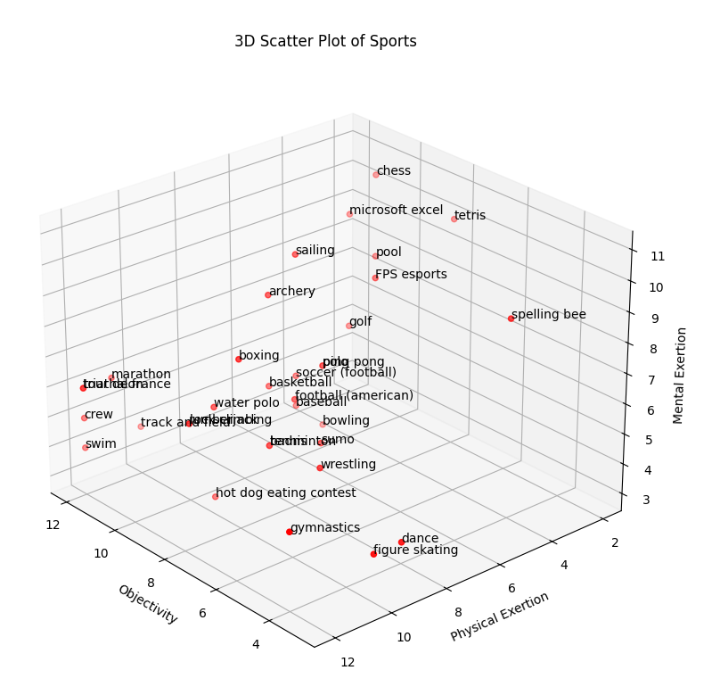

# The universal classification of sports

This is a crude attempt to come up with a cuberule for sports classsification.

We all know that chess, esports, and track *feel like* different "types" of sports but we just cant figure out why.

This project creates a 3d plot to attempt to cluster the sports together by some intuitive metrics

## Scoring Definitions
### objectivity
how objective is the scoring
0 - depends on how the judges feel 
3 - mostly subjective (figure skating, gymnastics, dance)
6 - 
9 - Semi objective, who won is clearly measurable but based on something arbitrary, such as points or baskets (basketball)
12 - totally objective and based on something measurable (distance, time) (crew)

### physical_exertion
how physically demanding is it (mental tougness included)
0 - not at all (chess)
3 - 
6 - 
9 - 
12 - very (tour de france, marathon, triathalon)

### mental_exertion
how mentally demanding is it
0 - not at all  
3 - meh (crew)
6 - mid (basketball)
9 - 
12 - very (chess)

## How to mess with this

1. open the `.csv` in libreoffice if you want
2. run `poetry install` to install python dependencies (requires poetry)
3. run `poetry run python3 sports.py` to see the data as a 3d graph